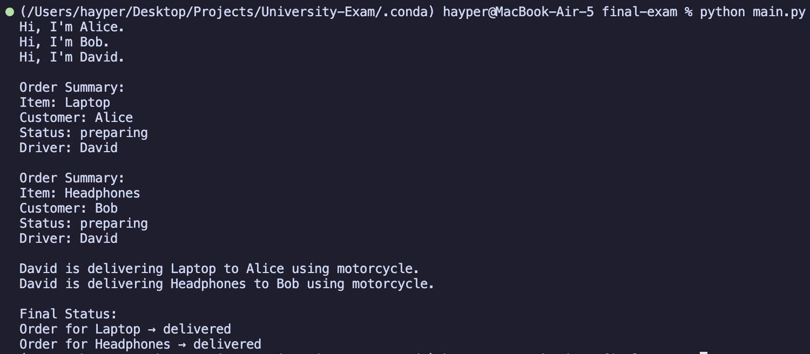

# Simple order delivery system

## Overview

This is a simple simulation script that simulate ordering system of a store.

## Features

You can create a person, or a customer, or a driver. A customer can create an order, and then the order can be assigned to a driver, then the driver can deliver the package.

## How to run

```py
python main.py
```

## Project structure

```
final-exam/
│
├── main.py # The script for running the simulation
├── output.png # Image file for the output
└── README.md
```

## Output



## Is this project 100% correctly implemented?

Yes.